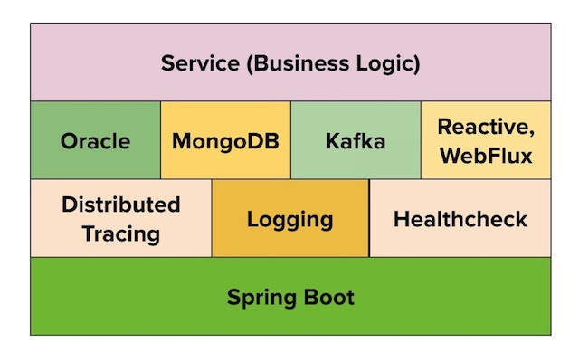

# **greenfield-app-starter**

---

The application starters will help Wells Fargo developers to create _non-reactive_ or _reactive_ microservices based on the business need:
- **greenfield-app-starter** for migrating a _legacy application_ to a cloud-ready microservice.
- **greenfield-reactive-app-starter** for _greenfield applications_, to take advantage of the non-blocking behavior which improves application performance and resiliency.

Both the app starters share a common tech stack, comprising components approved for use within Wells Fargo.

The **Application Starter Cookbook** contains recipes to help developers complete tasks required to build a fully functional spring boot microservice using the starters.

---
### Prerequisite

- JDK 8 or higher
- IntelliJ or Eclipse IDE
- GIT client
- Access to **Application Starter Cookbook**

---
### Notess
- [What is Reactive Programming ?](https://blog.redelastic.com/what-is-reactive-programming-bc9fa7f4a7fc)
- [Essence of Reactive Programming](https://www.scnsoft.com/blog/java-reactive-programming)