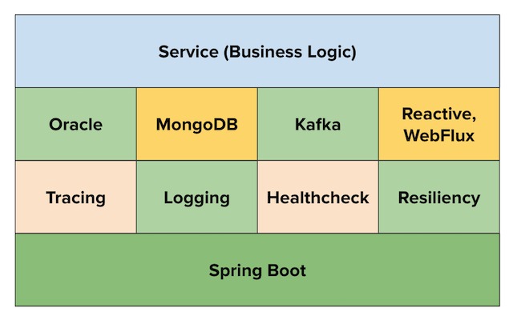

# **greenfield-app-starter**

---

The application starters will help Wells Fargo developers to create _non-reactive_ or _reactive_ microservices based on the business need:
- **greenfield-app-starter** can be used for migrating a _legacy application_ to a cloud-ready microservice or to create a non-reactive cloud-ready microservice.

The app starter share a common tech stack, comprising components approved for use within Wells Fargo.

The **Application Starter Cookbook** contains recipes to help developers complete tasks required to build a fully functional spring boot microservice using the starters.

---
### Prerequisite

- JDK 8 or higher
- IntelliJ or Eclipse IDE
- GIT client
- Access to **Application Starter Cookbook**

---
### Notes
